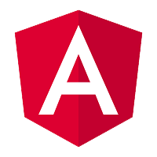
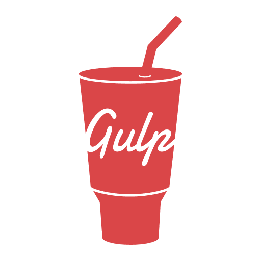
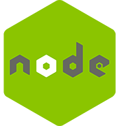

 
   Hello my name is Erick Ferreira,  I am <strong>Full-Stack Developer</strong> with focus in <strong>Front-End</strong>. 
    I have a certificate in IT and about to graduate in System Development for Internet.

----

#### 💼 Currently Working On

    Web systems for clubs partner programs such as Juventude (Partner Jaconero),
    Vasco da Gama (Partner-Giant), Santos (Partner-King) and Flamengo (NRN)

----

#### 🚀 My Primary Skills

<code title="JavaScript"></code>
<code title="React"></code>
<code title="Redux"></code>
<code title="Angular"></code>
<code title="Ionic"></code>
<code title="Sass"></code>
<code title="Gulp"></code>

<code title="Nodejs"></code>
<code title="PHP"></code>
<code title="AdonisJs"></code>
<code title="PostgreSQL"></code>
<code title="MySQL"></code>
---

#### ⭐ Info about my account GitHub

  
  <!--  -->

  

 
   💬 If you want to know more about me or just talk, don't hesitate to send me a message: ⤵️

  

  

  

 

